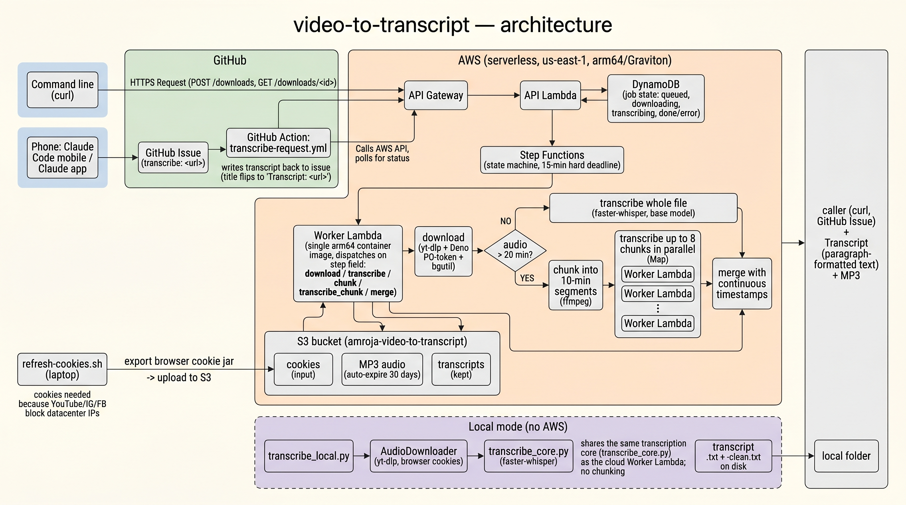

# video-to-transcript

Turn a video/audio URL into a **transcript**. Give it a link from YouTube,
Instagram, Facebook, X.com — anything
[yt-dlp](https://github.com/yt-dlp/yt-dlp) supports — and it downloads the
audio, transcribes it with [faster-whisper](https://github.com/SYSTRAN/faster-whisper),
and produces paragraph-formatted text. A few ways to run it, same transcription
core:

- **AWS endpoint** — a private HTTPS API; submit with `curl`, results land in
  S3. The main, always-on path.
- **Locally on your laptop** — one command, no AWS, transcripts written to a
  folder. See [Run it locally (no AWS)](#run-it-locally-no-aws).
- **From your phone** — ask the **Claude mobile app** to transcribe a URL; it
  files a GitHub issue that bridges to the AWS pipeline and reads the transcript
  back. See [From your phone](#from-your-phone).

## How it works



Everything runs **serverless on AWS — no servers to manage**:

```
POST /downloads ──▶ API Gateway ──▶ API Lambda
                                       │  writes job to DynamoDB (status=queued)
                                       └─ starts a Step Functions execution
                                              │
                    ┌─────────────────────────┴─────────────────────────┐
                    │  Worker Lambda (one container image, many steps)   │
                    │  download (yt-dlp) ─▶ short?  transcribe whole file │
                    │                       long?   chunk ─▶ N parallel   │
                    │                                transcribe ─▶ merge   │
                    └─────────────────────────┬─────────────────────────┘
                                              ▼
              MP3 + transcripts in S3,  status/result in DynamoDB
```

- **API Gateway + API Lambda** — auth, validation, job creation, reads.
- **Step Functions** — orchestrates the pipeline with a hard 15-minute deadline.
  Audio over 20 minutes is split into chunks and transcribed in parallel
  (up to 8 at once), then merged.
- **Worker Lambda** — a single container image (arm64) that handles every
  compute step. It runs on **Lambda's Graviton (arm64)** runtime, which is why
  the image is built for arm64.
- **S3** — stores cookies (input), MP3s, and transcripts. **DynamoDB** — job
  state. MP3s auto-expire after 30 days; transcripts are kept.

**Why cookies:** YouTube/Instagram/Facebook block datacenter IPs (including
AWS). The pipeline authenticates with a cookies file you export from your own
browser and store in S3 — one command, see [Refresh cookies](#refresh-cookies).

## Prerequisites

> **No AWS? Run it locally instead.** AWS is only needed for the always-on
> cloud endpoint and the phone/GitHub paths. If you don't have AWS (or just
> want transcripts on your laptop), skip everything below and jump to
> [Run it locally (no AWS)](#run-it-locally-no-aws) — it needs only Python,
> `ffmpeg`, and `deno`, no AWS account at all.

The commands below use macOS [Homebrew](https://brew.sh) (`brew`), but nothing
here is Mac-only. On **Linux** install the same tools with your distro's package
manager (`apt`, `dnf`, `pacman`, …); on **Windows** use
[winget](https://learn.microsoft.com/windows/package-manager/) or
[Chocolatey](https://chocolatey.org/) (e.g. `winget install ffmpeg` /
`choco install ffmpeg`), and run the bash scripts under WSL or Git Bash.
Substitute the `brew install …` lines accordingly. For the **AWS path** you need:

- **An AWS account** with permissions to deploy the stack (CloudFormation, ECR,
  Lambda, API Gateway, Step Functions, DynamoDB, S3, IAM), and the **AWS CLI**
  installed and configured with the **`sandbox` profile** (`aws configure
  --profile sandbox`). The stack deploys to **us-east-1**.
- **Docker** (Apple Silicon builds the arm64/Graviton image natively).
- A **local Python venv** — used by `refresh-cookies.sh` to export your browser
  cookies:

  ```bash
  brew install python@3.14
  /opt/homebrew/opt/python@3.14/bin/python3.14 -m venv .venv
  source .venv/bin/activate
  pip install -r requirements.txt
  ```

## Deploy

One command builds the image, deploys all the infrastructure, and prints your
endpoint + token:

```bash
./deploy.sh            # AWS profile "sandbox", us-east-1 by default
```

On success it prints the **API endpoint and a secret token** — save the token
(e.g. in 1Password). It's also written to the gitignored `.api-token` locally
and can't be recovered from AWS afterward. Re-run `./deploy.sh` after any code
change. First-run deploys take a few minutes (image build + two-phase stack
creation).

## Use it from the command line

Set these to the values `deploy.sh` printed:

```bash
URL="https://<api-id>.execute-api.us-east-1.amazonaws.com"
TOKEN="<your-api-token>"
```

**1. Submit a URL** (returns a job id immediately; transcription runs in the background):

```bash
curl -s -X POST "$URL/downloads" \
  -H "Content-Type: application/json" \
  -H "x-api-token: $TOKEN" \
  -d '{"url": "https://www.youtube.com/watch?v=jNQXAC9IVRw"}'
# -> {"id": "dd752f77-...", "status": "queued"}
```

**2. Check status / read the transcript** (poll until `status` is `done`):

```bash
curl -s "$URL/downloads/<job-id>" -H "x-api-token: $TOKEN"
```

Status flow: `queued → downloading → downloaded → transcribing → done | error`.
A short clip is `done` in well under a minute; a 40-minute video takes a few
minutes. When `done`, the response includes:

- `transcript` — the paragraph-formatted transcript, inline (up to 50KB)
- `transcript_url` / `transcript_clean_url` — presigned links to the full
  timestamped and clean transcript files
- `download_url` — presigned MP3 link (valid 1h; GET the job again for a fresh one)

**List recent jobs:**

```bash
curl -s "$URL/downloads?limit=25" -H "x-api-token: $TOKEN"
# pass the returned next_token as ?next_token=... to page
```

### Tested examples

```bash
# YouTube
curl -s -X POST "$URL/downloads" -H "Content-Type: application/json" \
  -H "x-api-token: $TOKEN" \
  -d '{"url": "https://www.youtube.com/watch?v=ACRd0Ikg_KI&t=1632s"}'

# X
curl -s -X POST "$URL/downloads" -H "Content-Type: application/json" \
  -H "x-api-token: $TOKEN" \
  -d '{"url": "https://x.com/jasminewsun/status/2061871693891776808/video/1"}'

# Instagram
curl -s -X POST "$URL/downloads" -H "Content-Type: application/json" \
  -H "x-api-token: $TOKEN" \
  -d '{"url": "https://www.instagram.com/reel/DZSmUechRoe/?igsh=MW14MmoycXMwemNhcg=="}'
```

## From your phone

You don't put this code on your phone. The phone path works through a GitHub
repo that acts as a request mailbox: from the **Claude mobile app** you ask
Claude to transcribe a URL, Claude files an issue in that repo, a workflow in
the repo runs the transcription on AWS and writes the result back into the
issue, and Claude reads it to you.

Set up once (you only need this when first installing). You should already have
**deployed the AWS stack** (see [Deploy](#deploy)) — you'll need the **API
endpoint** it printed and the token saved in the local **`.api-token`** file.

### 1. Pick the repo that will hold requests, and give it the workflow

The "request repo" is where each transcription becomes a GitHub issue. It must
contain the workflow file that does the work.

- **Easiest — reuse this repo.** If you deployed from this repo, it already
  contains [`.github/workflows/transcribe-request.yml`](.github/workflows/transcribe-request.yml).
  Nothing to add — go to step 2.
- **Or use a separate repo** (e.g. you want transcripts to live somewhere else).
  Create one and copy only the workflow file into it:
  ```bash
  # create the repo (or make one at github.com/new)
  gh repo create <owner>/<repo> --private

  # from your video-to-transcript checkout, copy the workflow into a clone of the new repo
  git clone https://github.com/<owner>/<repo>.git && cd <repo>
  mkdir -p .github/workflows
  cp /path/to/video-to-transcript/.github/workflows/transcribe-request.yml .github/workflows/
  git add .github/workflows/transcribe-request.yml
  git commit -m "Add transcription bridge workflow"
  git push
  ```

### 2. Add the two repo secrets

These tell the workflow how to reach your private AWS endpoint. The token never
leaves GitHub.

- **In the GitHub web UI:** open the repo → **Settings** → **Secrets and
  variables** → **Actions** → **New repository secret**. Add both:
  - Name `V2T_API_URL`, value = your API endpoint (e.g.
    `https://abc123.execute-api.us-east-1.amazonaws.com`)
  - Name `V2T_API_TOKEN`, value = the string inside your local `.api-token` file
- **Or with the `gh` CLI**, run from your `video-to-transcript` checkout (where
  `.api-token` lives):
  ```bash
  URL="https://<api-id>.execute-api.us-east-1.amazonaws.com"   # what deploy.sh printed
  gh secret set V2T_API_URL --repo <owner>/<repo> --body "$URL"
  printf %s "$(cat .api-token)" | gh secret set V2T_API_TOKEN --repo <owner>/<repo>
  ```

Re-set `V2T_API_TOKEN` after any redeploy that rotates the token. (If issue
writing ever fails, check **Settings → Actions → General → Workflow permissions**
is set to **Read and write**.)

### 3. Give Claude access to the repo

So Claude can create and read issues there:

1. In the **Claude app**, open **Settings → Connectors** (or **Integrations**)
   and connect **GitHub**; authorize the GitHub account that owns the request
   repo. This installs Anthropic's **Claude GitHub app** on that account.
2. When GitHub asks which repositories to grant, choose **Only select
   repositories** and include your request repo. (You can change this later at
   GitHub → **Settings → Applications → Claude → Configure**.)

Without this, Claude can't open or read the issues and the bridge won't work.

### 4. Create a Claude Project that knows the convention

Claude must title each issue `transcribe: <url>` (that's what triggers the
workflow) and read the result back when the title flips to `Transcript:`.

1. In the Claude app, create a **Project** (e.g. "Video Transcriber").
2. Open the Project's **custom instructions** and paste the ready-made block
   from [docs/claude-app-setup.md](docs/claude-app-setup.md), changing the
   repository name in it to your request repo.

### Use it

In that Project on your phone, say **"transcribe `<video URL>`"**. Claude files
the issue, the workflow runs the AWS pipeline (~1–6 minutes, longer for long
videos), and the transcript comes back in the issue. Works for YouTube,
Instagram, Facebook, and X.

## Run it locally (no AWS)

Prefer to keep everything on your laptop? `transcribe_local.py` does the whole
job — download + transcribe — in one process, writing transcripts to a folder.
No AWS, no cookies-in-S3, no job queue. It shares the exact same download and
transcription code as the cloud path.

**Setup** (one time):

```bash
brew install ffmpeg deno          # ffmpeg always; deno only for YouTube
python3.14 -m venv .venv
source .venv/bin/activate
pip install -r requirements-local.txt
```

On **Linux** use your package manager for `ffmpeg`/`deno` (`apt`, `dnf`,
`pacman`, …); on **Windows** use `winget install ffmpeg DenoLand.Deno` or
`choco install ffmpeg deno`. The Python steps are identical on every platform.

**Use it:**

```bash
source .venv/bin/activate

# One or more URLs → transcripts/YYYY-MM-DD/<title>.txt (+ -clean.txt)
python transcribe_local.py "https://www.youtube.com/watch?v=jNQXAC9IVRw"

# Custom output dir, bigger model, drop the MP3 afterward
python transcribe_local.py -o ~/transcripts --model small --no-keep-audio URL
```

Each URL produces two files next to the audio: `<title>.txt` (timestamped) and
`<title>-clean.txt` (paragraph-formatted). Notes:

- Uses your **Chrome cookies automatically** (first run prompts for macOS
  Keychain access — click "Always Allow"). Override with `--cookies-from-browser
  firefox` or `--cookies cookies.txt`.
- The **first run downloads the whisper model** (~150 MB for the default
  `base`); after that it's cached. `--model` accepts `tiny`/`base`/`small`/
  `medium`/`large-v3` or a local path — bigger is more accurate but slower.
- **No chunking** here — unlike the cloud path (which splits long audio to beat
  Lambda's 15-minute limit), the laptop just transcribes the whole file.

## Refresh cookies

Run this whenever cloud downloads start failing with bot/auth errors (e.g.
"Sign in to confirm you're not a bot"). It exports your browser's cookie jar
and uploads it to S3 where the pipeline reads it:

```bash
./refresh-cookies.sh                              # Chrome, bucket + profile from defaults
./refresh-cookies.sh -b my-bucket -p other-profile -B firefox
```

One export covers YouTube, Instagram, Facebook, and X. The S3 object is
versioned, so a bad export can be rolled back.

> **⚠️ Security — your cookies are live login sessions.** The uploaded file is
> your browser's cookie jar: it contains the **session cookies that keep you
> signed in** to Google/YouTube, Instagram, Facebook, and X. Anyone who can read
> it can load those cookies into their own browser and be **logged in as you on
> those accounts — no password, no 2FA prompt**.
>
> The stack creates the bucket locked down: **all public access blocked**
> (`BlockPublicAcls` / `BlockPublicPolicy` / `IgnorePublicAcls` /
> `RestrictPublicBuckets` all true), **server-side encryption** (AES-256) at
> rest, versioning on, and IAM scoped so the worker Lambda can only read the
> `cookies/` prefix. So it is **not reachable from the internet**.
>
> But that only protects against outsiders. **Anyone with read access to your
> AWS account or this S3 bucket can download your cookies** — admins, teammates
> with broad `s3:GetObject`, or anyone who can assume the worker role. **Make
> sure your AWS account is secure before deploying**, and treat a shared/company
> account with caution. If you don't fully control who can read the bucket,
> sign in with a **throwaway/service account** (not your personal logins) before
> running `refresh-cookies.sh`, or use [local mode](#run-it-locally-no-aws) for
> anything tied to your personal accounts.

## Transcript quality & limitations

Transcription is done with [faster-whisper](https://github.com/SYSTRAN/faster-whisper)
(a reimplementation of OpenAI's Whisper), so the output inherits Whisper's
known limitations. Treat transcripts as a very good first draft, not a
verbatim legal record:

- **No speaker labels.** Whisper transcribes *what* was said, not *who* said
  it. There's no diarization — multi-speaker audio comes back as one continuous
  stream with no "Speaker 1 / Speaker 2" attribution.
- **Hallucinations on non-speech and long audio.** During silence, music,
  applause, or background noise — and occasionally on long recordings — the
  model can invent text or repeat a phrase that wasn't actually spoken.
- **Accuracy varies with the audio.** Word error rate rises with strong
  accents, overlapping or crosstalk speech, noisy/low-bitrate audio, and
  non-English languages. Proper nouns, names, and domain jargon are frequently
  misspelled or guessed.
- **Model-size trade-off.** The cloud pipeline uses the fast, lower-accuracy
  `base` model. The local CLI can use a larger model (`--model small` /
  `medium` / `large-v3`) for noticeably better accuracy at the cost of speed.
- **Approximate timestamps & punctuation.** Timestamps are segment-level (not
  word-precise) and can drift; punctuation and capitalization are inferred by
  the model and may be inconsistent. On the chunked cloud path, a word can also
  clip or repeat at a 10-minute chunk seam.

## Maintenance & ops

- **Redeploy after code changes:** `./deploy.sh` (rebuilds the image, updates
  the worker Lambda, re-passes the saved token).
- **yt-dlp drifts** as sites change. If extraction starts failing across the
  board, rebuild fresh to pick up the latest yt-dlp:
  `docker build --no-cache .` then `./deploy.sh`. Keep `BGUTIL_TAG` in the
  Dockerfile in sync with `bgutil-ytdlp-pot-provider` in `requirements.txt`.
- **Tear down:** empty the S3 bucket, then
  `aws cloudformation delete-stack --stack-name video-to-transcript --profile sandbox`.

## Troubleshooting

| Symptom | Fix |
|---|---|
| Job ends in `error` with a bot/auth message | Cookies expired → `./refresh-cookies.sh`, then resubmit |
| Downloads worked before, now all fail | yt-dlp drift → rebuild the image (`docker build --no-cache .`) and `./deploy.sh` |
| Job stuck and never reaches `done` | The pipeline has a hard 15-minute deadline; a job past that is reported as `error` on the next status check |
| "PO-token server did not start" in worker logs | YouTube may fail while other sites still work; check the worker Lambda logs in CloudWatch |
